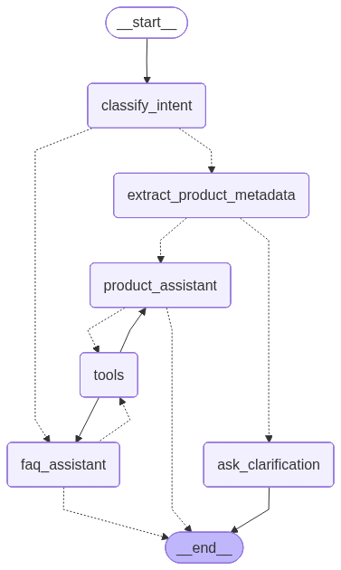

# AI Fashion Shopping Assistant

Conversational shopping assistant built with **LangChain** and **LangGraph** that maintains context across turns and uses FAISS semantic search for personalized product recommendations.

## Features

- **Smart Routing**: Classifies intent and routes between FAQ/product search automatically
- **Semantic Search**: FAISS vector search with metadata filtering (color, gender, usage, type)
- **Adaptive Suggestions**: Recommends filters when results are too broad (>10 items)

## Tech Stack

- **LLM**: Gemini 2.0 Flash | **Vector DB**: FAISS | **Embeddings**: all-MiniLM-L6-v2
- **Framework**: LangGraph + LangChain ReAct agents | **Structured Outputs**: Pydantic v2

## Quick Start

```bash
# Install
pip install -r requirements.txt

# Configure
echo "GOOGLE_API_KEY=your_key_here" > .env

# Run
python main.py
```

## Usage Example

```
User: Show me casual shirts
Bot: [Returns 15 casual shirts, suggests: "Filter by Men/Women or color?"]

User: Black mens
Bot: [Refines to black casual shirts for men - 5 results]
```

## Architecture

**Whole workflow of Assistant** with 6 nodes using LangGraph's conditional routing:



**Flow:**
1. **classify_intent** → Determines FAQ vs Product search
2. **extract_metadata** → Extracts filters from conversation history (color, gender, type)
3. **product_assistant/faq_assistant** → ReAct agents with tool calling
4. **tools** → Execute searches (FAISS vector search)
5. **ask_clarification** → Requests missing info when needed

**Key Implementation:**
- Multi-turn memory with MemorySaver checkpointer for stateful multi-turn conversations
- Post-FAISS metadata filtering (10k retrieval → filter → top-k)
- Context-aware extraction (combines previous + current messages)

---